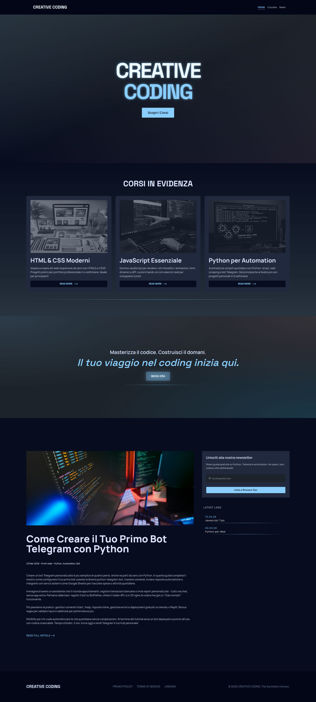

# **Website Restyle Frontend \- Esercizio 3 (Vite \+ Multi-Branch)**

## **Panoramica Progetto**

Il progetto modernizza un sito web datato (anni 2010\) con layout obsoleto, non responsive e performance scarse, trasformandolo in una landing page professionale conforme agli standard 2025/2026: mobile-first, accessibile, performante (Lighthouse ≥90) e con design immersivo.​  
* Evoluzione in 3 versioni principali: da HTML semantico base (V1) ad UI/UX avanzata con animazioni (V2) fino a tema dark pro con mesh gradients e glow effects (V3 finale).

## **Struttura Repo**

`website-restyle-frontend/`

`├── 01-original-html/     # Layout originale obsoleto (float/tables, jQuery)`

`├── 02-figma/             # Prototipi Figma (wireframe, mockup, design system)`

`├── 03-sito-moderno/      # Versioni evolute (V1→V3)`

`│   ├── index.html        # Sito live (V3: 15.7kB, dark theme)`

`│   ├── src/style.css     # Tailwind custom (5.5kB)`

`│   ├── assets/fonts/     # Manrope, Space Grotesk`

`│   ├── public/img/       # Ottimizzate lazy (webp)`

`│   └── public/icons/     # SVG`

`└── docs/                 # Documentazione tecnica completa`

Demo live: apri 03-sito-moderno/index.html o localhost:5173 (Vite dev).​

## **Tecnologie Stack**

| Tecnologia | Ruolo | Vantaggi vs 01-original-html (V0 obsoleto) |
| :---- | :---- | :---- |
| Vite | Build tool / Dev server | Hot reload istantaneo, bundle 10x più leggero vs no build system; FCP 0.8s vs blocking JS V0.​ |
| Figma | Prototipazione UI/UX | Wireframe/mockup interattivi, design system (palette, spacing, varianti dark); impossibile con tool 2010\. |
| Tailwind CSS | Styling utility-first | Responsive/mobile-first nativo (max-w-1200px, media queries), custom vars (20+); elimina float hell e CSS verbose V0 (3x più veloce sviluppo). |
| DaisyUI | Componenti Tailwind | Drawer responsive, navbar glow, theme dark/light switch; sostituisce jQuery Nivo Slider pesante (TBT 0ms vs blocking). |

Perché queste vs V0: V0 usava float/tables (non responsive), jQuery 1.7 (sicuro ma lento), no semantica → SEO/accessibilità bassa. Stack moderno: Performance \+40pt Lighthouse, dark/mesh trends 2026, codice manutenibile.

## **Evoluzione Versioni**

| Versione | Focus Principale | Miglioramenti Chiave | Lighthouse Performance |
| :---- | :---- | :---- | :---- |
| V1 | HTML5 semantico responsive | Flex/Grid vs float, DaisyUI drawer, no JS | 90​ |
| V2 | UI/UX Figma \+ animazioni | Hover scale/shadow, backdrop-blur navbar, Kaushan font | 87​ |
| V3 (Finale) | Dark pro \+ effetti premium | Mesh gradients radiali, glow links (\#89CEFF), scroll-smooth anchors | 91​ |

V3 risolve: no dark mode V2 → DaisyUI dark; scroll brusco → scroll-smooth; immagini pesanti → lazy webp.​

## **Installazione & Setup**

1. Clone repo: git clone https://github.com/granafilo/website-restyle-frontend.git  
2. Entra in 03-sito-moderno/: cd 03-sito-moderno  
3. Installa dipendenze: npm install (Tailwind/Vite)  
4. Avvia dev server: npm run dev → localhost:5173  
5. Build produzione: npm run build → /dist

Prerequisiti: Node.js 18+, npm/yarn. Nessun server backend necessario.​

## **Metriche & Testing**

* Lighthouse (V3): Performance 91, Accessibility 80, Best Practices 96, SEO 100 (FCP 0.8s, CLS 0.002).​  
* W3C Validazione: HTML/CSS passed, ARIA labels completi.​  
* Responsive: Mobile→2xl, test Chrome/FF/Safari.

## **Screenshot & Figma**

* Figma V3:   
[Figma V3](https://www.figma.com/design/XausdV5gdMplWiwRySSMvY/Esercizio_3-V3)  
*  (dark variants, hover states).​  
* Hero V3: Dark mesh gradient con glow links e scroll fluido.

## **Changelog**

* V3 (23/03/26): Dark theme, mesh gradients, glow shadows → \+4pt perf.​  
* V2 (21/03/26): Anim hover, fixed navbar blur → UX engaging.​  
* V1 (14/03/26): Semantica responsive → \+40pt vs V0.​

## **Conclusioni**

V3 trasforma sito obsoleto in landing 2026 pro: fedeltà layout \+ modernità (dark/glow/mesh). Lezioni: Tailwind/DaisyUI accelerano 3x, Figma essenziale per polish. 

Autore: Filippo Granata | Data: Marzo 2026 

